# Path-Planning-Algorithms


**Author:** Koti Reddy Syamala

Educational, from-scratch implementations of classic and modern path
planning algorithms in Python, with matplotlib/imageio visualizations for
every one of them. This is Phase 1 of a three-phase robotics portfolio — see
[ROADMAP.md](ROADMAP.md) for how it connects to the PX4/Gazebo and SLAM
phases in the sibling repos.

## Gallery

<table>
<tr>
<td align="center"><b>A*</b><br>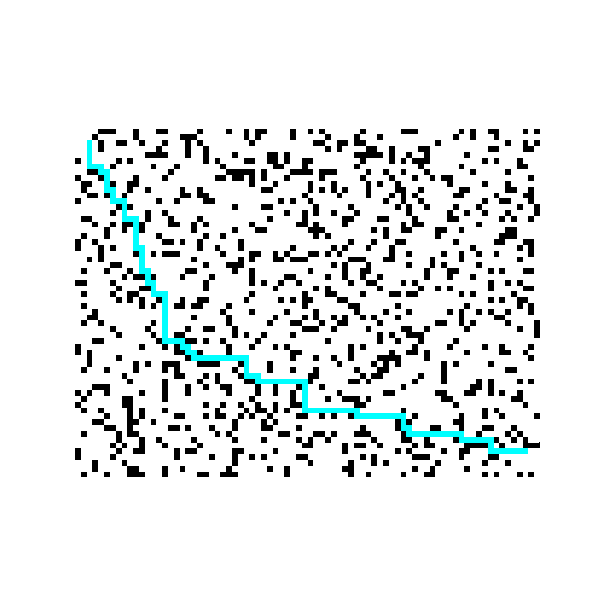</td>
<td align="center"><b>RRT</b><br>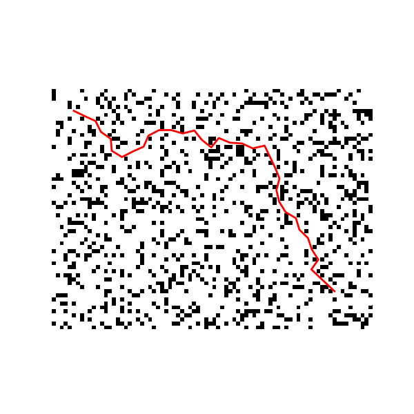</td>
<td align="center"><b>RRT*</b><br>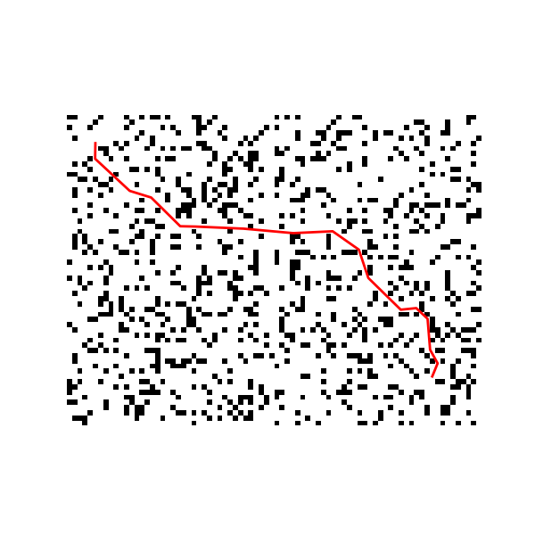</td>
</tr>
<tr>
<td align="center"><b>Informed RRT*</b><br>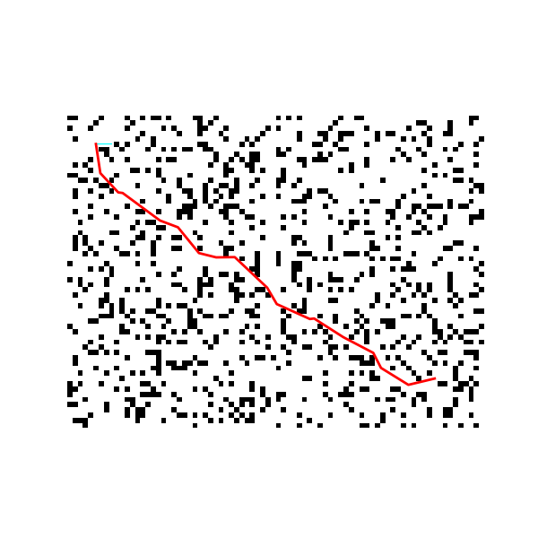</td>
<td align="center"><b>Dubins Path</b><br>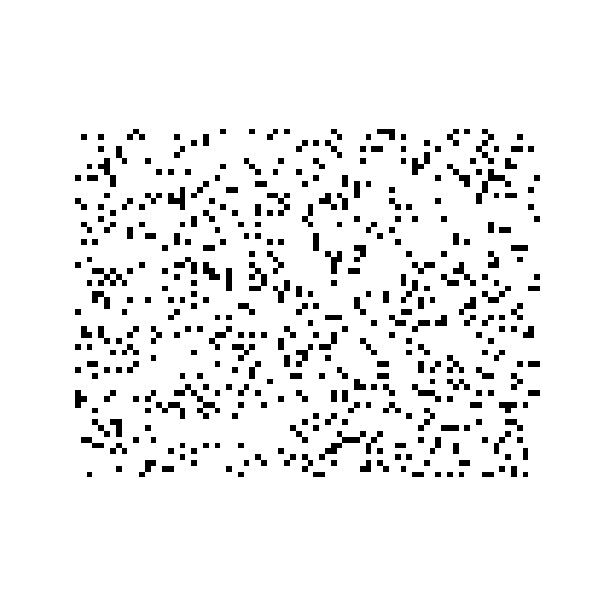</td>
<td align="center"><b>PRM</b><br>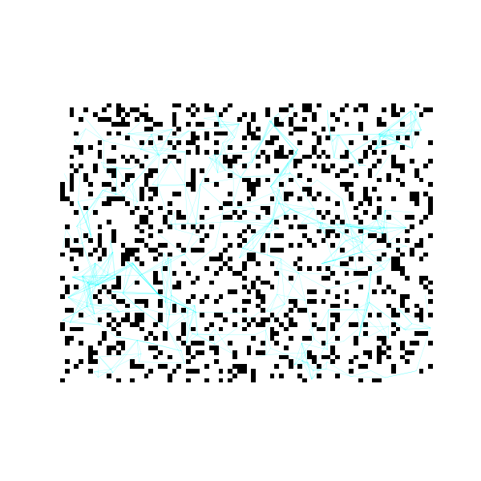</td>
</tr>
<tr>
<td align="center"><b>D* Lite — initial search</b><br>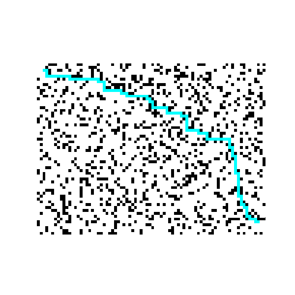</td>
<td align="center"><b>D* Lite — incremental replan</b><br>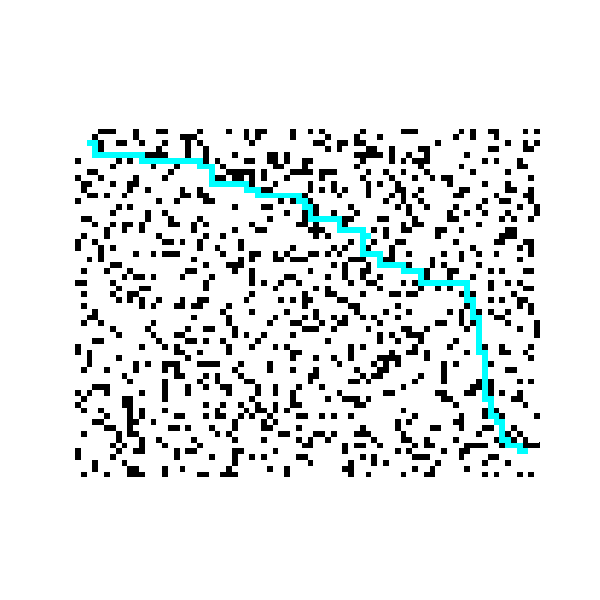</td>
<td align="center"><b>Dynamic-obstacle RRT</b><br>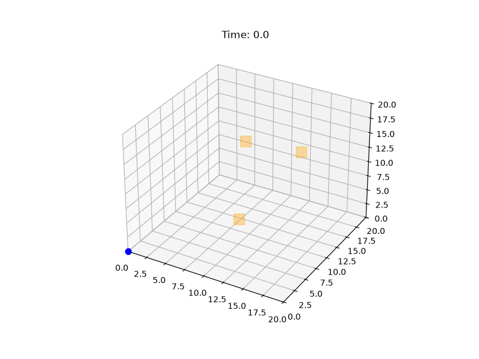</td>
</tr>
<tr>
<td align="center"><b>3D RRT (cube obstacles)</b><br>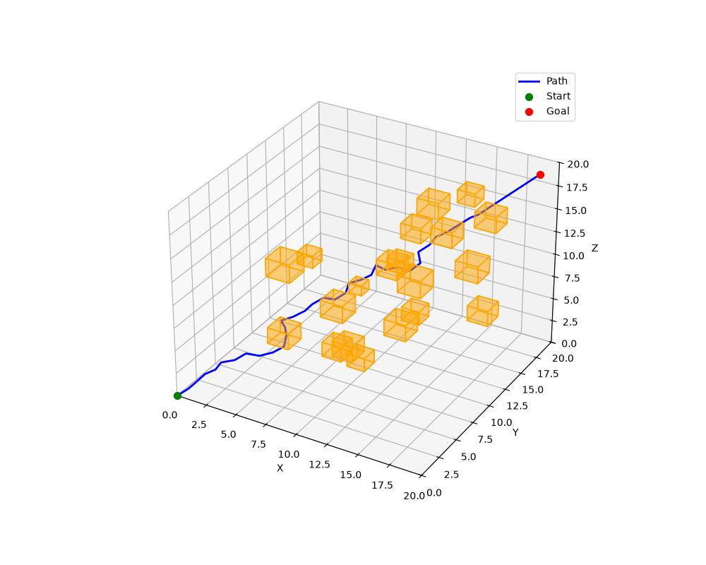</td>
<td align="center"><b>Dynamic-obstacle RRT (snapshot)</b><br>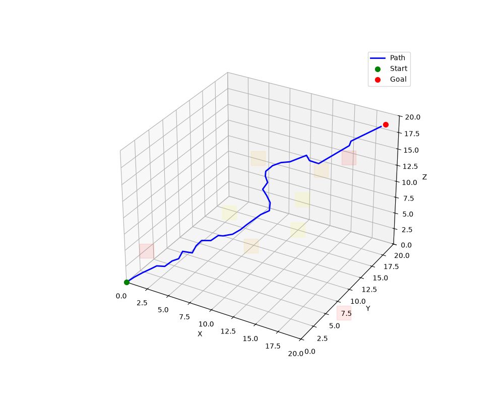</td>
<td></td>
</tr>
</table>

The D* Lite pair is the standout: the left GIF is a full search from
scratch (2089 vertices expanded); the right GIF is what happens when a cell
on that path gets blocked afterward — D* Lite reprocesses just 2 vertices to
find the detour, instead of rerunning A* over the whole grid.

## Algorithms

| Algorithm | Source | Notes |
|---|---|---|
| A* | [`path_planning/a_star.py`](path_planning/a_star.py) | Grid search; also exposes `search_steps()`/`astar_steps()` generators (A*, Dijkstra, or Greedy Best-First by priority function) for step-through visualization. |
| D* Lite | [`path_planning/d_star_lite.py`](path_planning/d_star_lite.py) | Incremental replanning search (Koenig & Likhachev, 2002); searches backward from the goal and only reprocesses vertices whose cost actually changed after an obstacle appears. |
| RRT | [`path_planning/rrt.py`](path_planning/rrt.py) | Rapidly-exploring Random Tree. |
| RRT* | [`path_planning/rrt_star.py`](path_planning/rrt_star.py) | RRT with rewiring for asymptotically optimal paths. |
| Informed RRT* | [`path_planning/informed_rrt_star.py`](path_planning/informed_rrt_star.py) | RRT* that restricts sampling to the shrinking prolate-hyperspheroid (ellipse in 2D) once a first solution is found (Gammell et al., 2014). |
| PRM | [`path_planning/prm.py`](path_planning/prm.py) | Probabilistic Roadmap: sample free space, connect nearby collision-free pairs, query with Dijkstra. |
| Dubins path | [`path_planning/dubins.py`](path_planning/dubins.py) | Shortest path for a fixed-turning-radius vehicle between two poses. |
| A* (3D) | [`path_planning/a_star_3d.py`](path_planning/a_star_3d.py) | A* over a voxel grid ([`Grid3D`](path_planning/grid3d.py)). |
| RRT (3D, continuous) | [`path_planning/rrt_3d_continuous.py`](path_planning/rrt_3d_continuous.py) | RRT in continuous 3D space with cuboid obstacles, no voxel grid. |
| Kinodynamic RRT | [`path_planning/rrt_kinodynamic.py`](path_planning/rrt_kinodynamic.py) | RRT over `(x, y, z, yaw, pitch)` states with bounded per-step yaw/pitch change, for vehicles that can't turn in place. |
| Dynamic-obstacle RRT | [`path_planning/rrt_dynamic.py`](path_planning/rrt_dynamic.py) | RRT in space-time against moving [`DynamicObstacle`](path_planning/dynamic_obstacle.py)s (linear-velocity AABBs). |

## Interactive & comparison tools

Step-through viewers built on the `_steps()` generators — useful for
building intuition, not just watching a finished GIF:

- **`examples/interactive_astar.py`** — step A* one expansion at a time; shows the open/closed sets and live g/h/f costs.
- **`examples/compare_search.py`** — A*, Dijkstra, Greedy Best-First, and D* Lite side by side on the same grid, stepping in lockstep, shaded by cost so you can see how each priority function reshapes the search.
- **`examples/compare_sampling.py`** — RRT*, Informed RRT*, and PRM side by side, revealing tree/roadmap growth.

All three are keyboard-driven (`→`/space to step, `a` to autoplay, `r` to reset, `q`/`esc` to quit) and open a live matplotlib window, so run them locally rather than over SSH.

## Quick start

```bash
python -m pip install -r requirements.txt
```

Run a 2D demo (writes a GIF to the repo root):

```bash
python examples/run_demo.py --algo astar     # astar_demo.gif
python examples/run_demo.py --algo rrt       # rrt_demo.gif
python examples/run_demo.py --algo rrtstar   # rrtstar_demo.gif
python examples/run_demo.py --algo dubins    # dubins_demo.gif
```

Run the rest of the demos (each prints what it found and writes to `output/` or the repo root):

```bash
python examples/run_demo_d_star_lite.py          # d_star_lite_initial.gif, d_star_lite_replanned.gif
python examples/run_demo_informed_rrt_star.py    # output/informed_rrt_star_demo.gif
python examples/run_demo_prm.py                  # output/prm_demo.gif
python examples/run_demo_3d.py                   # 3D A*, console output only
python examples/run_demo_3d_rrt.py                # 3D RRT among cubes, console output only
python examples/visualize_3d_rrt.py               # output/rrt_3d_cubes_demo.png
python examples/run_demo_rrt_dynamic.py           # dynamic-obstacle RRT, console output only
python examples/visualize_dynamic_rrt.py          # output/rrt_dynamic_demo.png
python examples/animate_dynamic_rrt.py            # output/rrt_dynamic_animation.gif
python examples/run_demo_rrt_kinodynamic.py       # kinodynamic RRT, console output only
```

## Testing

```bash
pytest tests/
```

8 tests covering the grid, A* (2D/3D), D* Lite (initial search + replan),
RRT, Informed RRT*, and PRM.

## Project structure

```
path_planning/     algorithm implementations (2D, 3D, dynamic, kinodynamic)
examples/          runnable demos, interactive viewers, comparison tools
tests/             pytest suite
visualize.py        shared matplotlib/imageio helpers for frame generation
output/             generated images/GIFs for the newer demos
```

## Roadmap

This repository is Phase 1 of a larger portfolio — see [ROADMAP.md](ROADMAP.md):

1. **Path-Planning-Algorithms** (this repo) — 2D/3D planning sandbox.
2. [ROS2-Drone-Controller](../ROS2-Drone-Controller) — PX4 + Gazebo simulation, ROS 2 control nodes.
3. [Autonomous-Drone-SLAM-Navigation](../Autonomous-Drone-SLAM-Navigation) — SLAM + online replanning on the full stack.

## License

MIT — see [LICENSE](LICENSE).
